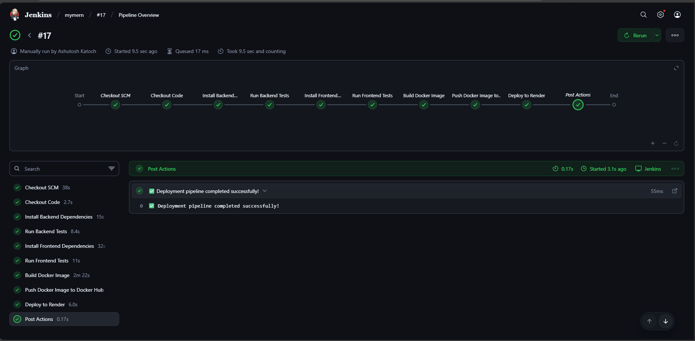
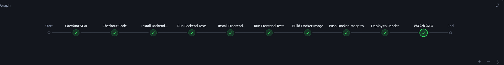

# MERN App CI/CD Pipeline with Jenkins, Docker & Render

This project demonstrates a **complete CI/CD pipeline** for a MERN stack application using **Jenkins**, **Docker**, and **Render** for deployment. It automates building, testing, dockerizing, and deploying the app every time you push code to GitHub.

---

## 🔹 Pipeline Overview

The pipeline is defined in the `Jenkinsfile` located in the **root of the project**. Here's what happens automatically:

1. **Code Checkout**  
   - Jenkins pulls the latest code from the GitHub repository.

2. **Install Dependencies & Run Tests**  
   - Installs all Node.js dependencies.  
   - Runs any tests (optional — won’t fail if tests are not defined).

3. **Build Docker Image**  
   - Builds a Docker image of the MERN application using the `Dockerfile`.

4. **Push Docker Image to Docker Hub**  
   - Jenkins logs in to Docker Hub using credentials stored securely in Jenkins.  
   - Pushes the Docker image to your Docker Hub repository.

5. **Deploy to Render**  
   - Triggers a Render deploy hook to automatically redeploy the latest version of your app.

---

## 🔹 Jenkins Pipeline Screenshots

Here are screenshots of the Jenkins pipeline running successfully:

  

## 🔹 Deployed Website

The app is live and can be accessed here:  
[🌐 Visit Flixify](https://flixify-3916.onrender.com)

Here’s a screenshot of the deployed app:

---

## 🔹 Jenkinsfile Key Sections

pipeline {
    agent any

    environment {
        DOCKERHUB_CREDENTIALS = credentials('dockerhub-cred')     // Docker Hub credentials ID
        RENDER_DEPLOY_URL = credentials('render-hook-url')        // Render Deploy Hook credential ID
        DOCKER_IMAGE = "xphenomenal/mern-app"                    // replace with your Docker Hub image name
    }

    stages {
        stage('Checkout Code') {
            steps {
                echo '📦 Cloning the repository...'
                git branch: 'main', url: 'https://github.com/Xphenomenal008/Netflixlike-webiste.git'
            }
        }

        stage('Install Backend Dependencies') {
            steps {
                echo '🧩 Installing backend dependencies...'
                bat 'cd backend && npm install --legacy-peer-deps'
            }
        }

        stage('Run Backend Tests') {
            steps {
                echo '🧪 Running backend tests...'
                bat 'cd backend && npm test'
            }
        }

        stage('Install Frontend Dependencies') {
            steps {
                echo '🧩 Installing frontend dependencies...'
                bat 'cd frontend && npm install'
            }
        }

        stage('Run Frontend Tests') {
            steps {
                echo '🧪 Running frontend tests...'
                bat 'cd frontend && npm test'
            }
        }

        stage('Build Docker Image') {
            steps {
                echo '🐳 Building Docker image...'
                bat "docker build -t %DOCKER_IMAGE% ."
            }
        }

        stage('Push Docker Image to Docker Hub') {
            steps {
                echo '📤 Pushing Docker image to Docker Hub...'
                bat "echo %DOCKERHUB_CREDENTIALS_PSW% | docker login -u %DOCKERHUB_CREDENTIALS_USR% --password-stdin"
                bat "docker push %DOCKER_IMAGE%"
            }
        }

        stage('Deploy to Render') {
            steps {
                echo '🚀 Triggering Render deployment...'
                bat "curl -X POST %RENDER_DEPLOY_URL%"
            }
        }
    }

    post {
        success {
            echo '✅ Deployment pipeline completed successfully!'
        }
        failure {
            echo '❌ Deployment pipeline failed. Check console logs for details.'
        }
    }
}

 