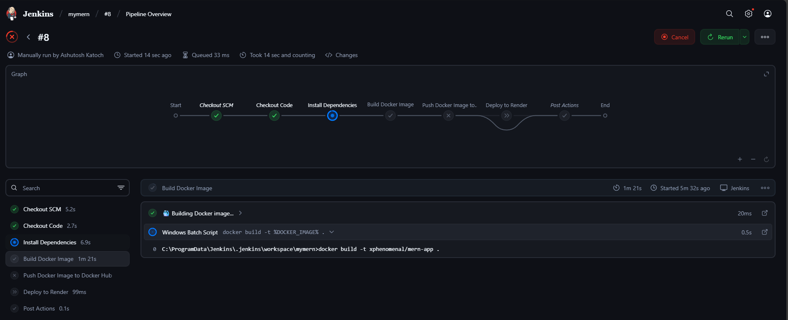
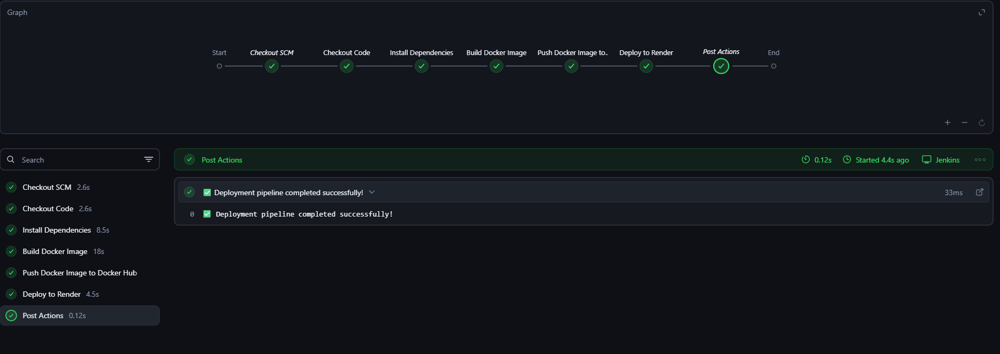

# MERN App CI/CD Pipeline with Jenkins, Docker & Render

This project demonstrates a **complete CI/CD pipeline** for a MERN stack application using **Jenkins**, **Docker**, and **Render** for deployment. It automates building, testing, dockerizing, and deploying the app every time you push code to GitHub.

---

## 🔹 Pipeline Overview

The pipeline is defined in the `Jenkinsfile` located in the **root of the project**. Here's what happens automatically:

1. **Code Checkout**  
   - Jenkins pulls the latest code from the GitHub repository.

2. **Install Dependencies & Run Tests**  
   - Installs all Node.js dependencies.  
   - Runs any tests (optional — won’t fail if tests are not defined).

3. **Build Docker Image**  
   - Builds a Docker image of the MERN application using the `Dockerfile`.

4. **Push Docker Image to Docker Hub**  
   - Jenkins logs in to Docker Hub using credentials stored securely in Jenkins.  
   - Pushes the Docker image to your Docker Hub repository.

5. **Deploy to Render**  
   - Triggers a Render deploy hook to automatically redeploy the latest version of your app.

---

## 🔹 Jenkins Pipeline Screenshots

Here are screenshots of the Jenkins pipeline running successfully:

  


## 🔹 Deployed Website

The app is live and can be accessed here:  
[🌐 Visit Flixify](https://flixify-3916.onrender.com)

Here’s a screenshot of the deployed app:


---

## 🔹 Jenkinsfile Key Sections

```groovy
pipeline {
    agent any

    environment {
        DOCKERHUB_CREDENTIALS = credentials('dockerhub-cred')   // Docker Hub login credentials
        RENDER_DEPLOY_URL = credentials('render-hook-url')      // Render deploy hook secret
        DOCKER_IMAGE = "yourdockerhubusername/mern-app"         // Docker image name
    }

    stages {
        stage('Checkout') {
            steps {
                git branch: 'main', url: 'https://github.com/yourusername/yourrepo.git'
            }
        }

        stage('Install & Test') {
            steps {
                sh 'npm install'
                sh 'npm test || echo "No tests defined"'
            }
        }

        stage('Build Docker Image') {
            steps {
                sh 'docker build -t $DOCKER_IMAGE .'
            }
        }

        stage('Push to Docker Hub') {
            steps {
                withCredentials([usernamePassword(credentialsId: 'dockerhub-cred', passwordVariable: 'DOCKER_PASS', usernameVariable: 'DOCKER_USER')]) {
                    sh 'echo $DOCKER_PASS | docker login -u $DOCKER_USER --password-stdin'
                    sh 'docker push $DOCKER_IMAGE'
                }
            }
        }

        stage('Deploy to Render') {
            steps {
                sh "curl -X POST $RENDER_DEPLOY_URL"
            }
        }
    }
}
